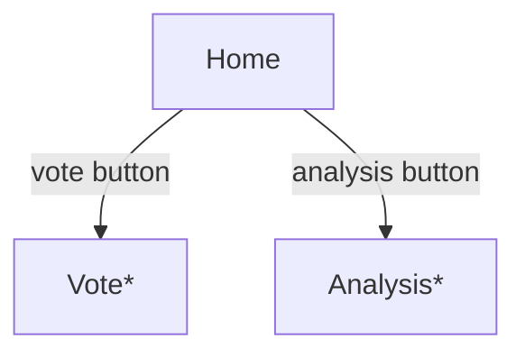

# てくめじろ - Web技術投票 & 解析サービス

以前作成した複数投票可能な人気投票サイトで、単なる順位でなく「これが好きな人はこれも好き」を表示する様にしたら結構面白かったので、Web技術で同じ様なものを作ったら面白そうだと考えています。

## 名前の由来

メジロ可愛いですよね、上手くできたらWeb技術が目白押しになっているグラフィックにしたいです。

## やりたいこと

### コア機能

- Web技術でよく使うもの、好きなもの、おすすめなものの組み合わせを投票してもらいます
- 単なる人気投票でなく、ある技術を使っている人が、他にどんな技術を使用しているか表示します
- Google OAuth により、1 Google Account で 1 投票にして信憑性のあるデータを集めます

### 出来ればやりたいこと

- ランキングはメジロが目白押しになっている数で表現されます
- 収益化どうするんでしょうね...

### 使いたい技術

- Drizzle ORM v1.0
  - まだ beta ですが、TypeScript でスキーマ定義できるの良いと思います
- Next.js v16
  - Cached Components 活用してみたいです
- Hono + RPC
  - Drizzle ORM で DB から FE まで型情報が伝播するのは開発体験が良いです
- Better Auth
  - 最近話題の認証ライブラリ、使い心地を試してみたいです
  - 食わず嫌いしている DB セッション管理をちゃんと使ってみたいです
  - DB + Hono をセルフホストする構成なので Hono 側に入ります

### 画面遷移

- Vote 画面はログイン必須で、失敗した場合は Home に戻る
- Analysis 画面はログインがオプションで、ログインしている場合はユーザ毎の分析が出る
